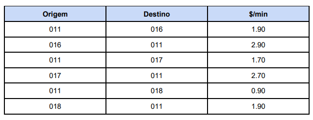
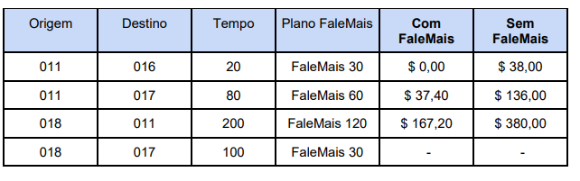
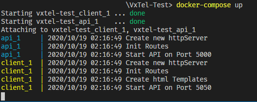
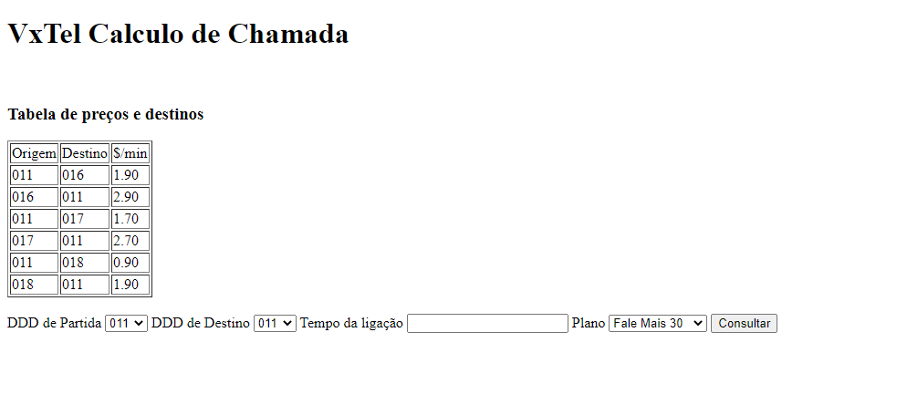

## Desafio ##
A empresa de telefonia **VxTel**, especializada em chamadas de longa distância nacional, vai
colocar um novo produto no mercado chamado **FaleMais**.

Normalmente um cliente **VxTel** pode fazer uma chamada de uma cidade para outra pagando
uma tarifa fixa por minuto, com o preço sendo pré-definido em uma lista com os códigos DDDs
de origem e destino:

<br>
<br>



<br>
<br>

Com o novo produto **FaleMais** da **VxTel** o cliente adquire um plano e pode falar de graça até
um determinado tempo (em minutos) e só paga os minutos excedentes. Os minutos
excedentes tem um acrescimo de 10% sobre a tarifa normal do minuto. Os planos são
FaleMais 30 (30 minutos), FaleMais 60 (60 minutos) e FaleMais 120 (120 minutos).

A **VxTel**, preocupada com a transparência junto aos seus clientes, quer disponibilizar uma
página na web onde o cliente pode calcular o valor da ligação. Ali, o cliente pode escolher os
códigos das cidades de origem e destino, o tempo da ligação em minutos e escolher qual o
plano **FaleMais**. O sistema deve mostrar dois valores: (1) o valor da ligação com o plano e (2)
sem o plano. O custo inicial de aquisição do plano deve ser desconsiderado para este
problema. 

<br>
<br>

Exemplo de Valores:



<br>

## Sobre o Projeto ##
Ele está dividido em uma api rest onde vai ser calculado o valor da ligação, e o outro a parte do client, foi feita uma seperação pensando em dois serviços destintos. 

A estrutura dos pacotes foi feita com base no [golang-standards/project-layout](https://github.com/golang-standards/project-layout)

```
api
  |__cmd //Pacote onde está contida a main
  |
  |__csv //Arquivo csv contendo os preços
  |
  |__internal     //Códigos de biblioteca que não podem ser usados por
  |   |           //aplicativos externos
  |   |
  |   |__apirest    //Faz a lógica do api rest
  |   |__store      //Contém as structs utilizadas

images //Imagens utilizada no README.md

clientGo
  |__cmd //Pacote onde está contida a main
  |
  |__internal     //Códigos de biblioteca que não podem ser usados por
  |   |           //aplicativos externos
  |   |
  |   |__http    //Faz a lógica da interface do client
  |   |   |__templates //htmls utilizados para montar as pag. web
  |   |__store      //Contém as structs utilizadas

```
<br>
<br>

## Como Usar ##

Para começar a utilizar é preciso ter o docker instalado, disponível no [link](https://docs.docker.com/get-docker/). E também o Docker-Compose no [link](https://docs.docker.com/compose/install/).

Para dar um start nas aplicações basta usar o comando abaixo na raíz do projeto:

```
docker-compose up
```
<br>



(DESCONSIDERE ESSA PARTE CASO O **docker-compose up** FUNCIONE) Primeiro será criado uma network para que possa efetuar as chamadas http com sucesso, caso o ip dessa network tiver em uso, mude os ips do arquivo docker-compose.yml para o de sua escolha e copie o ip utilizado na api do docker-compose.yml dentro do ENV do Arquivo Dockerfile do ClienteGo.

## API Rest ##

A api atende chamdas de consulta pelo metodo **POST** no endereço:

```
http://localhost:5000/consult
```
<br>

A api recebe como parametro um json contendo:


Var         | Type        | Descrição
:-------    | :---------  |:---------
start       | string      | DDD que fara a ligação
final       | string      | DDD de destino
time        | int         | Tempo da ligação
plano       | string      | Qual o plano que será utilizado
<br>

Exemplo:

```json
{
	"start":"018",
	"final":"011",
	"time":200,
	"plano":"120"
}
```

A resposta também é um json contendo:

Var         | Type        | Descrição
:-------    | :---------  |:---------
start       | string      | DDD que fara a ligação
final       | string      | DDD de destino
value       | string      | Valor a pagar com o plano
time        | string      | Tempo da ligação
ValueFull   | string      | Valor a pagar sem o plano
plano       | string      | Plano que está sendo utilizado para calcular
<br>

Exemplo:
```json
{
  "start": "018",
  "final": "011",
  "value": "167.20",
  "time": "200",
  "ValueFull": "380.00",
  "plano": "120"
}
```

## Interface do Cliente ## 

A interface do cliente é aonde a pessoa poderá introduzir os paramêtros e fazer o cálculo das chamadas.

A interface pode ser acessado no navegador pelo endereço.
```
http://localhost:5050/
```
<br>

Ela apresenta essa característica.



<br>
<br>
Após a consulta a api retornara os dados e eles serão dispostos nem uma tabela. 

